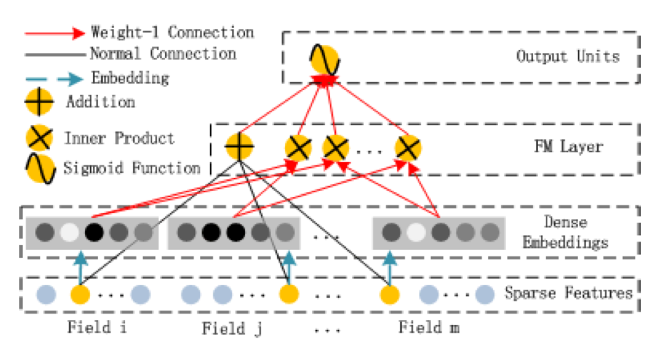
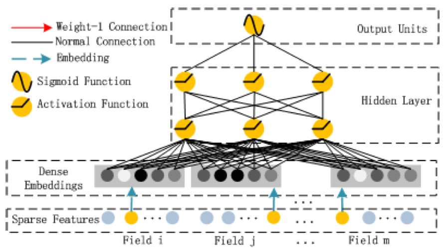

### DeepFM

#### Reference

DeepFM: A Factorization-Machine based Neural Network for CTR Prediction，IJCAI 2017

#### Introduction

在 CTR 预估中，核心问题是发现特征之间的交互关系，有些特征之间的关系可以通过人工来挖掘。然而，大部分的特征交互是隐藏在数据中的，很难被人工挖掘到，比如著名的"啤酒和尿布"问题。

下面是一些主流模型在CTR预估问题中的优缺点：

**线性模型**简单易用，但是缺乏挖掘高阶特征的能力，针对这一缺点，**FM**刻画了成对的特征间的交互关系，并且效果非常的好，但是由于较高的时间复杂度，FM只能挖掘二阶的特征。深度学习由于能够自动挖掘特征见得关系，最近几年得到了广泛的应用，**CNN，RNN**都有被尝试的相关工作。但是CNN只能挖掘邻近特征间的关系，而RNN更适用于序列类型数据的特征挖掘。**FNN**先用FM预训练categorical类型数据的embedding，之后输入到用全连接的神经网络中，而**PNN**让embedding作为模型本身的参数，且引入了一个product layer，来挖掘高阶的特征。为了同时描述高阶特征和低阶特征，Google于2016年提出了一个混合的**Wide & Deep**模型，该模型有一个"deep"部分的神经网络和一个"wide"的线性模型，但是"wide"部分同样也需要特征工程。

这篇文章的贡献可以总结如下：

$\bullet$ 提出了一个基于神经网络的模型DeepFM，并将神经网络和FM结合到了一起。通过FM挖掘低阶特征间的关系，通过神经网络来挖掘高阶特征间的关系。并且通过end-to-end的方式训练，不需要额外的特征工程。

$\bullet$ DeepFM的两个组成部分共享同一个输入以及embedding，减小了模型的复杂度。

#### Model Description

假设数据集$(\mathcal{X}, y)$中有$n$个样本，通常包含一个user和item的pair，$y\in\left\{0,1\right\}$为标签，表示该item是否被用户点击。$\mathcal{X}$ 中可能既包含categorical类型的数据，也包含连续类型的数据。每个categorical通过one-hot编码表示，continuous类型的数据不做处理，或者分桶后再进行one-hot编码。因此，每个样本可以表示为如下的向量：
$$
x = [x_{field_1},x_{field_2},...,x_{field_j},...,x_{field_m}]
$$
通常情况下，$x$是非常高维且稀疏的。CTR预估的任务就是通过建立一个预测模型 $\hat{y}=CTR_{model}(x)$ 来预测用户点击item的概率。

DeepFM的整体网络结构如下所示：

DeepFM由FM和Deep两部分组成，并共享同一个输入。对于第$i$个特征，一个标量$w_i$表示其一阶特征的重要性，一个latent vector $V_i$表示其与其它特征间的关系，其在FM部分中描述二阶特征，在Deep部分中表示更高阶的特征。所有的参数，包括$w_i, V_i$，以及神经网络本身的参数都是随着网络一起训练的，输出可以表示如下：
$$
\hat{y} = sigmoid(y_{FM} + y_{DNN})
$$

#### FM Component

DeepFM的FM部分就是一个因子分解机(Factorization Machine)，在模型中FM主要用来学习一阶和二阶特征，FM的结构如下所示：

FM的输出为：$y_{FM}=<w,x> + \sum_{i=1}^d\sum_{j=i+1}^d<V_i,V_j>x_ix_j$，其中$V_i$稠密的embedding。

#### Deep Component

DeepFM中的Deep Component是一个简单的全连接的神经网络，用来学习高阶的组合特征，网络结构如下图所示：

与适用于CNN的图像以及语音数据相比，CTR预估中的输入是非常不同的，输入的向量通常是极度稀疏，极度高维度，Categorical和Continuous数据混合，因此类似NLP中Word Embedding的思路，将输入转化成低维稠密的embedding对于神经网络是非常有意义的。

下图表示网络输入的embedding层，输入的两个特点有(在当时看来的特点)：1）不同特征经过one-hot编码后的长度是不同的，但是它们的embedding向量的长度都是相同的。2）Embedding矩阵$V$在有的工作中是预训练好的，但在DeepFM中，是随着网络一起训练的。定义embedding层的输出为：
$$
a^{(0)} = [e_1, e_2,...,e_m]
$$
其中$e_i$是第$i$个field(特征)的embedding向量，之后$a^{(0)}$作为全连接神经网络的输入，前向过程为：
$$
a^{(l+1)} = \sigma(W^{(l)}a^{(l)} + b^{(l)})
$$
其中，$l$为神经网络的深度，$\sigma$为激活函数，最后一个稠密的实向量$y_{DNN}$生成。
